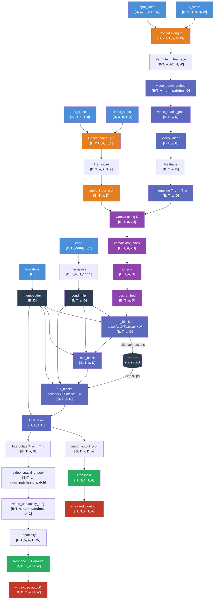

```mermaid
flowchart TD
    XA["x_audio\n<b>[B, D_a, T_a]</b>"]
    XV["x_video\n<b>[B, C, T_v, H, W]</b>"]
    IA["input_audio\n<b>[B, D_a, T_a]</b>"]
    IV["input_video\n<b>[B, C, T_v, H, W]</b>"]
    TS["timesteps\n<b>[B]</b>"]
    CD["cond\n<b>[B, D_cond, T_a]</b>"]

    XA --> CAT_A["Concat along D_a\n<b>[B, 2·D_a, T_a]</b>"]
    IA --> CAT_A
    CAT_A --> TRANS_A["Transpose\n<b>[B, T_a, 2·D_a]</b>"]
    TRANS_A --> APROJ["audio_input_proj\n<b>[B, T_a, D]</b>"]

    XV --> CAT_V["Concat along C\n<b>[B, 2C, T_v, H, W]</b>"]
    IV --> CAT_V
    CAT_V --> PERM_V["Permute → Reshape\n<b>[B·T_v, 2C, H, W]</b>"]
    PERM_V --> PATCH["video_patch_embed\n<b>[B·T_v, num_patches, D]</b>"]
    PATCH --> SPOOL["video_spatial_pool\n<b>[B·T_v, D]</b>"]
    SPOOL --> VLIN["video_linear\n<b>[B·T_v, D]</b>"]
    VLIN --> RESHP["Reshape\n<b>[B, T_v, D]</b>"]
    RESHP --> INTERP["Interpolate T_v → T_a\n<b>[B, T_a, D]</b>"]

    APROJ --> CATAV["Concat along D\n<b>[B, T_a, 2D]</b>"]
    INTERP --> CATAV

    CATAV --> CNX["convnextv2_block\n<b>[B, T_a, 2D]</b>"]
    CNX --> AVPROJ["av_proj\n<b>[B, T_a, D]</b>"]
    AVPROJ --> POSEMB["pos_embed\n<b>[B, T_a, D]</b>"]

    TS --> TEMB["t_embedder\n<b>[B, D]</b>"]
    CD --> TRANS_C["Transpose\n<b>[B, T_a, D_cond]</b>"]
    TRANS_C --> CMLP["cond_mlp\n<b>[B, T_a, D]</b>"]

    POSEMB --> IN_BLK["in_blocks\n<i>encoder DiT blocks × N</i>\n<b>[B, T_a, D]</b>"]
    TEMB --> IN_BLK
    CMLP --> IN_BLK
    IN_BLK -->|skip connections| SKIP[("skips stack")]

    IN_BLK --> MID["mid_block\n<b>[B, T_a, D]</b>"]
    TEMB --> MID
    CMLP --> MID

    MID --> OUT_BLK["out_blocks\n<i>decoder DiT blocks × N</i>\n<b>[B, T_a, D]</b>"]
    SKIP -->|pop skips| OUT_BLK
    TEMB --> OUT_BLK
    CMLP --> OUT_BLK

    OUT_BLK --> FINAL["final_layer\n<b>[B, T_a, D]</b>"]
    TEMB --> FINAL

    FINAL --> AOUT_P["audio_output_proj\n<b>[B, T_a, D_a]</b>"]
    AOUT_P --> AOUT_T["Transpose\n<b>[B, D_a, T_a]</b>"]
    AOUT_T --> VA["v_a  (audio output)\n<b>[B, D_a, T_a]</b>"]

    FINAL --> VOUT_I["Interpolate T_a → T_v\n<b>[B, T_v, D]</b>"]
    VOUT_I --> UNPOOL["video_spatial_unpool\n<b>[B·T_v, num_patches·d_patch]</b>"]
    UNPOOL --> UNPATCH_P["video_unpatchify_proj\n<b>[B·T_v, num_patches, p²·C]</b>"]
    UNPATCH_P --> UNPATCH["unpatchify\n<b>[B·T_v, C, H, W]</b>"]
    UNPATCH --> VOUT_R["Reshape → Permute\n<b>[B, C, T_v, H, W]</b>"]
    VOUT_R --> VV["v_v  (video output)\n<b>[B, C, T_v, H, W]</b>"]

    style XA fill:#4a90d9,color:#fff
    style XV fill:#4a90d9,color:#fff
    style IA fill:#4a90d9,color:#fff
    style IV fill:#4a90d9,color:#fff
    style TS fill:#4a90d9,color:#fff
    style CD fill:#4a90d9,color:#fff
    style CAT_A fill:#e67e22,color:#fff
    style CAT_V fill:#e67e22,color:#fff
    style APROJ fill:#e67e22,color:#fff
    style PATCH fill:#5b6abf,color:#fff
    style SPOOL fill:#5b6abf,color:#fff
    style VLIN fill:#5b6abf,color:#fff
    style INTERP fill:#5b6abf,color:#fff
    style CATAV fill:#8e44ad,color:#fff
    style CNX fill:#8e44ad,color:#fff
    style AVPROJ fill:#8e44ad,color:#fff
    style POSEMB fill:#8e44ad,color:#fff
    style TEMB fill:#2c3e50,color:#fff
    style CMLP fill:#2c3e50,color:#fff
    style IN_BLK fill:#5b6abf,color:#fff
    style MID fill:#5b6abf,color:#fff
    style OUT_BLK fill:#5b6abf,color:#fff
    style FINAL fill:#5b6abf,color:#fff
    style SKIP fill:#2c3e50,color:#fff
    style VA fill:#c0392b,color:#fff
    style VV fill:#c0392b,color:#fff
    style AOUT_T fill:#27ae60,color:#fff
    style VOUT_R fill:#27ae60,color:#fff
```
